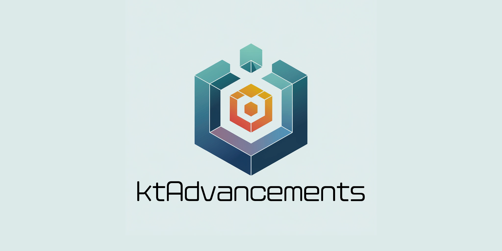
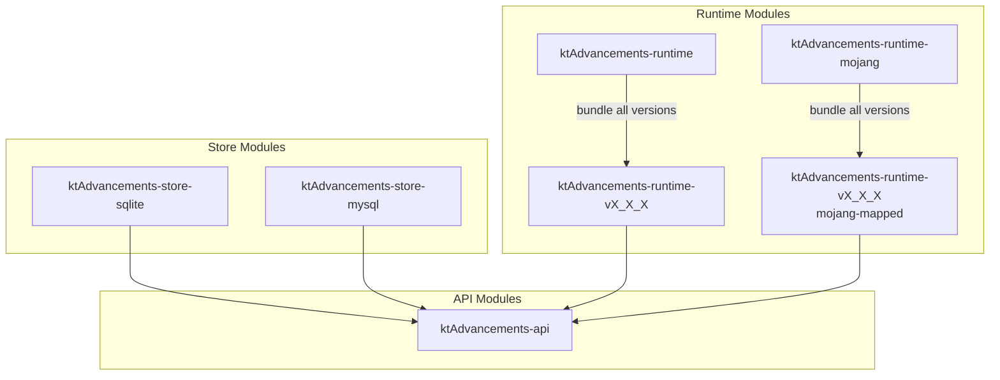

[](assets/logo.png)

A lightweight, packet-based Minecraft advancements library for Spigot/Paper plugins with customizable runtime and data storage.

## Features

- **📦 Packet-based Implementation**: Lightweight and efficient advancement management
- **🔌 Bundlable**: Can be included directly in your plugin
- **🔄 Customizable Runtime**: Support for multiple Minecraft versions and custom implementations
- **💾 Flexible Data Storage**: Support for custom storage solutions
  - [InMemory](#-ktadvancementstoreinmemory): Default in-memory storage
  - [SQLite](#-ktadvancementstoresqlite): Persistent storage with SQLite (requires `ktAdvancements-store-sqlite` addon)
  - [MySQL](#-ktadvancementstoremysql): Persistent storage with MySQL (requires `ktAdvancements-store-mysql` addon)
  - [Custom Implementation](#-custom-storage): Create your own storage solution
- **🛡️ Type-safe Advancement Creation**: Safe and intuitive API for creating advancements
- **📊 Progress Tracking**: Detailed progress management with step-based control
- **👁️ Visibility Control**: Flexible visibility options with custom implementation support

## Installation

This library requires API and Runtime components. Add the following to your `build.gradle.kts`:

```kotlin
repositories {
    mavenLocal()  // Use this after running ./gradlew publishToMavenLocal
}

dependencies {
    implementation("dev.s7a:ktAdvancements-api:1.0.0-SNAPSHOT")
    implementation("dev.s7a:ktAdvancements-runtime:1.0.0-SNAPSHOT")
}
```

For other runtime options, see the Runtime Options section below.

## Runtime Options

This library provides multiple runtime options to suit different needs. For more information about Mojang-mapped vs Spigot-mapped runtimes, see the [Mojang-mapped vs Spigot-mapped](#mojang-mapped-vs-spigot-mapped) section.

### 1. Multi-Version Runtime (Recommended)
Use this if you need to support multiple Minecraft versions:
```kotlin
// For Spigot plugins
implementation("dev.s7a:ktAdvancements-runtime:1.0.0-SNAPSHOT")

// For Paper plugins (mojang-mapped)
implementation("dev.s7a:ktAdvancements-runtime-mojang:1.0.0-SNAPSHOT")
```

### 2. Version-Specific Runtime
Use this if you only need to support a specific Minecraft version:
```kotlin
// For Spigot plugins
implementation("dev.s7a:ktAdvancements-runtime-v1_17_1:1.0.0-SNAPSHOT")

// For Paper plugins (mojang-mapped)
implementation("dev.s7a:ktAdvancements-runtime-v1_17_1:1.0.0-SNAPSHOT:mojang-mapped")
```

### 3. Custom Runtime
If your target version is not supported, you can create your own runtime:

1. Add `ktAdvancements-api` as a dependency:
```kotlin
dependencies {
    implementation("dev.s7a:ktAdvancements-api:1.0.0-SNAPSHOT")
}
```

2. Implement a class based on `KtAdvancementRuntime`:
```kotlin
class YourCustomRuntime : KtAdvancementRuntime {
    override fun sendPacket(
        player: Player,
        reset: Boolean,
        advancements: Map<KtAdvancement, Int>,
        removed: Set<NamespacedKey>,
    ) {
        TODO("Implement packet sending logic")
    }
}
```

3. Create an instance of your custom runtime and use it:
```kotlin
val customRuntime = YourCustomRuntime()
val ktAdvancements = KtAdvancements(store, customRuntime)
```

## Usage

### Creating an Advancement

```kotlin
val advancement = KtAdvancement(
    parent = null, // Optional parent advancement
    id = NamespacedKey(plugin, "example_advancement"),
    display = KtAdvancement.Display(
        x = 0f,
        y = 0f,
        icon = ItemStack(Material.DIAMOND),
        title = "Example Advancement",
        description = "Complete this example advancement",
        frame = KtAdvancement.Display.Frame.Task
    ),
    requirement = 1, // Number of steps required to complete the advancement
    visibility = KtAdvancement.Visibility.Always
)
```

#### 📊 About Progress Management

- The `requirement` parameter represents the number of steps needed to complete the advancement
- Internally, criteria are created as base-36 strings for each step
- Due to packet size limitations, it's recommended to keep the `requirement` value small
- While vanilla Minecraft allows custom criteria strings, this library uses a simplified numeric step system for better performance

#### 👁️ About Visibility

The library provides several visibility options:

- `Always`: Always visible
- `HaveProgress`: Visible when player has any progress
- `Granted`: Visible only when advancement is granted
- `ParentGranted`: Visible when parent advancement is granted
- `Any`: Visible when any of the specified conditions are met
- `All`: Visible when all specified conditions are met

You can also create your own visibility class by implementing `KtAdvancement.Visibility`:

```kotlin
class CustomVisibility : KtAdvancement.Visibility {
    override fun isShow(
        advancement: KtAdvancement,
        store: KtAdvancementStore,
        player: Player,
    ): Boolean {
        TODO("Your custom visibility logic here")
    }
}
```

### Managing Advancements

```kotlin
// Initialize KtAdvancements (runtime will be automatically selected based on version)
val ktAdvancements = KtAdvancements(KtAdvancementStore.InMemory())

// Register advancement
ktAdvancements.register(advancement)

// Show all advancements to player (call this when player joins the server)
ktAdvancements.showAll(player)

// Grant advancement to player (complete all steps)
ktAdvancements.grant(player, advancement)

// Grant specific step of advancement
ktAdvancements.grant(player, advancement, step = 1)

// Revoke advancement from player (complete all steps)
ktAdvancements.revoke(player, advancement)

// Revoke specific step of advancement
ktAdvancements.revoke(player, advancement, step = 1)
```

### Data Storage

The library provides multiple storage options for advancement progress:

#### 💾 KtAdvancementStore.InMemory

Default in-memory data store:

```kotlin
val ktAdvancements = KtAdvancements(KtAdvancementStore.InMemory())
```

#### 🗄️ KtAdvancementStore.SQLite

Persistent data storage using SQLite:

```kotlin
// Add dependency to your build.gradle.kts
dependencies {
    implementation("dev.s7a:ktAdvancements-store-sqlite:1.0.0-SNAPSHOT")

    // SQLite JDBC driver is bundled with Spigot by default
    // Install if you need a different version
    // implementation("org.xerial:sqlite-jdbc:{VERSION}")
}
```

```kotlin
// Initialize with database path
val ktAdvancements = KtAdvancements(KtAdvancementStore.SQLite("path/to/database.db"))

// Create a table
ktAdvancements.store.onEnable()

// Close connections
ktAdvancements.store.onDisable()
```

#### 🗄️ KtAdvancementStore.MySQL

Persistent data storage using MySQL:

```kotlin
// Add dependency to your build.gradle.kts
dependencies {
    implementation("dev.s7a:ktAdvancements-store-mysql:1.0.0-SNAPSHOT")
    implementation("mysql:mysql-connector-java:8.0.33")
}
```

```kotlin
// Initialize with MySQL connection details
val ktAdvancements = KtAdvancements(
    KtAdvancementStore.MySQL(
        host = "localhost",
        port = 3306,
        database = "minecraft",
        username = "root",
        password = "password",
        tableName = "advancement_progress", // optional
        options = mapOf( // optional
            "useSSL" to "false",
            "serverTimezone" to "UTC",
            "characterEncoding" to "utf8mb4"
        )
    )
)

// Create a table
ktAdvancements.store.onEnable()

// Close connections
ktAdvancements.store.onDisable()
```

#### 🔧 Custom Storage

You can create your own data store by implementing `KtAdvancementStore`:

```kotlin
class CustomStore : KtAdvancementStore {
    override fun getProgress(
        player: Player,
        advancement: KtAdvancement,
    ): Int {
        TODO("Get progress from your custom storage")
    }

    override fun setProgress(
        player: Player,
        advancement: KtAdvancement,
        progress: Int,
    ) {
        TODO("Save progress to your custom storage")
    }
}
```

## For Developers

### Project Structure



The library is divided into several modules with the following dependencies:

1. **API Modules**: Define interfaces and data structures
   - `ktAdvancements-api`: Core advancement data structures and runtime interface definitions

2. **Runtime Modules**: Version-specific implementations
   - `ktAdvancements-runtime`: Aggregates all Spigot runtimes (bundle all versions)
   - `ktAdvancements-runtime-mojang`: Aggregates all Mojang-mapped runtimes (bundle all versions)
   - Each version has its own runtime module (e.g., `ktAdvancements-runtime-vX_X_X`)
   - Mojang-mapped versions use the `mojang-mapped` classifier

3. **Store Modules**: Data storage implementations
   - `ktAdvancements-store-sqlite`: SQLite-based persistent storage
   - `ktAdvancements-store-mysql`: MySQL-based persistent storage

### Mojang-mapped vs Spigot-mapped

As of 1.20.5, Paper ships with a Mojang-mapped runtime instead of re-obfuscating the server to Spigot mappings. Additionally, CraftBukkit classes will no longer be relocated into a versioned package. This requires plugins to be deobfuscated before loading when necessary.

Most of this process is done automatically by paperweight, but there are some important things to know when using server internals (or "NMS") from now on:

- **Default mappings assumption**:
  - By default, all Spigot/Bukkit plugins will be assumed to be Spigot-mapped if they do not specify their mappings namespace in the manifest
  - All Paper plugins will be assumed to be Mojang-mapped if they do not specify their mappings namespace in the manifest
  - Spigot-mapped plugins will need to be deobfuscated on first load, Mojang-mapped plugins will not

For more details, please refer to the [Paper documentation](https://docs.papermc.io/paper/dev/userdev/#1205-and-beyond).

## License

This project is licensed under the MIT License - see the LICENSE file for details.
