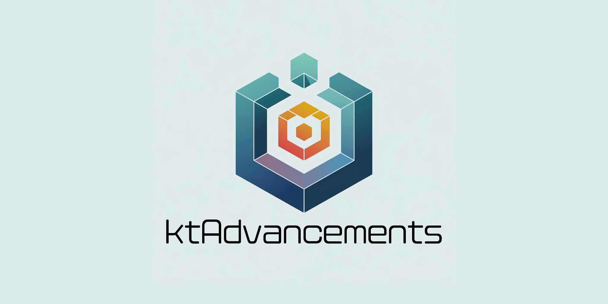
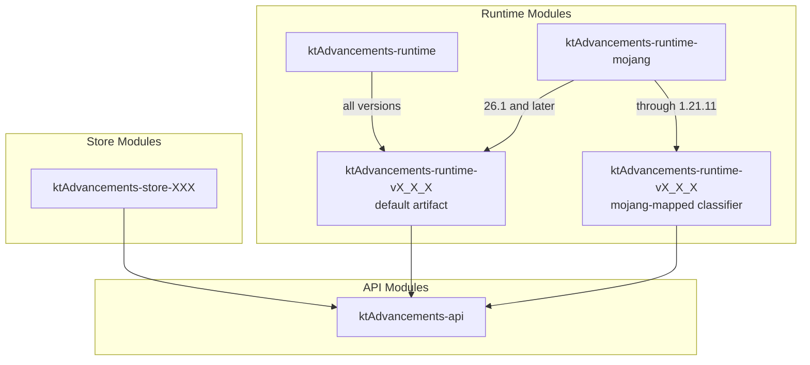

[](assets/logo.png)

A lightweight, packet-based Minecraft advancements library for Spigot/Paper plugins with customizable runtime and data storage.

## Features

- **📦 Packet-based Implementation**: Lightweight and efficient advancement management
- **🔌 Bundlable**: Can be included directly in your plugin
- **🔄 Customizable Runtime**: Support for multiple Minecraft versions and custom implementations
- **💾 Flexible Data Storage**: Support for custom storage solutions
  - [InMemory](#-ktadvancementstoreinmemory): Default in-memory storage
  - [SQLite](#%EF%B8%8F-ktadvancementstoresqlite): Persistent storage with SQLite (requires `ktAdvancements-store-sqlite` addon)
  - [MySQL](#%EF%B8%8F-ktadvancementstoremysql): Persistent storage with MySQL (requires `ktAdvancements-store-mysql` addon)
  - [Custom Implementation](#-custom-storage): Create your own storage solution
- **🛡️ Type-safe Advancement Creation**: Safe and intuitive API for creating advancements
- **📊 Progress Tracking**: Detailed progress management with step-based control
- **👁️ Visibility Control**: Flexible visibility options with custom implementation support

## Installation

This library requires API and Runtime components. Add the following to your `build.gradle.kts`:

```kotlin
repositories {
    maven(url = "https://central.sonatype.com/repository/maven-snapshots/")
}

dependencies {
    implementation("dev.s7a:ktAdvancements-api:1.0.0-SNAPSHOT")
    implementation("dev.s7a:ktAdvancements-runtime:1.0.0-SNAPSHOT")
    
    // Add any of the following store implementations as needed
    // implementation("dev.s7a:ktAdvancements-store-XXX:1.0.0-SNAPSHOT")
}
```

- For other runtime options, see the [Runtime Options](#runtime-options) section below.
- For storage options, see the [Data Storage](#data-storage) section below.

## Agent Skill

This repository also includes a distributable agent skill at `skills/ktadvancements`.
It is written for general AI agents, not just Codex, and summarizes how to use ktAdvancements in Kotlin Bukkit, Spigot, and Paper projects.

### Install with `gh skill`

```bash
gh skill preview sya-ri/ktAdvancements skills/ktadvancements
```

### Install with `npx skills`

```bash
npx skills add sya-ri/ktAdvancements --skill ktadvancements
```

After installing, restart the agent tool so it reloads available skills.

## Runtime Options

This library provides multiple runtime options to suit different needs. For more information about Mojang-mapped vs Spigot-mapped runtimes, see the [Mojang-mapped vs Spigot-mapped](#mojang-mapped-vs-spigot-mapped) section.

### 1. Multi-Version Runtime (Recommended)
Use this if you need to support multiple Minecraft versions:
```kotlin
// Spigot-mapped through 1.21.11; unobfuscated from 26.1 onward
implementation("dev.s7a:ktAdvancements-runtime:1.0.0-SNAPSHOT")

// Mojang-mapped through 1.21.11; the same unobfuscated artifacts from 26.1 onward
implementation("dev.s7a:ktAdvancements-runtime-mojang:1.0.0-SNAPSHOT")
```

For Paper 1.20.5+, use the Mojang-mapped aggregate and declare the namespace in your final plugin JAR.
Older Paper remappers cannot process the Java 25 classes included by the Spigot-mapped aggregate;
see [Mojang-mapped vs Spigot-mapped](#mojang-mapped-vs-spigot-mapped) below.

### 2. Version-Specific Runtime
Use this if you only need to support a specific Minecraft version:
```kotlin
// For Spigot/Paper plugins up to 1.21.11
implementation("dev.s7a:ktAdvancements-runtime-v1_17_1:1.0.0-SNAPSHOT")

// For Paper plugins
implementation("dev.s7a:ktAdvancements-runtime-v1_17_1:1.0.0-SNAPSHOT:mojang-mapped")
```

For Minecraft `26.1+`, Spigot and Paper use the same normal unobfuscated runtime artifact:
```kotlin
implementation("dev.s7a:ktAdvancements-runtime-v26_1_2:1.0.0-SNAPSHOT")
```

The 26.1, 26.1.1, and 26.1.2 runtime modules compile against Paper's 26.1.2 dev bundle because Paper does not publish an exact 26.1 bundle. [Spigot documents the 26.1.2 server as fully compatible with the earlier 26.1 releases](https://www.spigotmc.org/threads/spigot-bungeecord-26-1-26-1-1-26-1-2.718646/).

#### Supported versions

Spigot/Paper:
- 1.17.1
- 1.18
- 1.18.1
- 1.18.2
- 1.19
- 1.19.1
- 1.19.2
- 1.19.3
- 1.19.4
- 1.20
- 1.20.1
- 1.20.2
- 1.20.3
- 1.20.4
- 1.20.6
- 1.21
- 1.21.1
- 1.21.3
- 1.21.4
- 1.21.5
- 1.21.6
- 1.21.7
- 1.21.8
- 1.21.9
- 1.21.10
- 1.21.11
- 26.1
- 26.1.1
- 26.1.2
- 26.2

### 3. Custom Runtime
If your target version is not supported, you can create your own runtime:

1. Add `ktAdvancements-api` as a dependency:
```kotlin
dependencies {
    implementation("dev.s7a:ktAdvancements-api:1.0.0-SNAPSHOT")
}
```

2. Implement a class based on `KtAdvancementRuntime`:
```kotlin
class YourCustomRuntime : KtAdvancementRuntime {
    override fun sendPacket(
        player: Player,
        reset: Boolean,
        advancements: Map<KtAdvancement, Int>,
        removed: Set<NamespacedKey>,
    ) {
        TODO("Implement packet sending logic")
    }
}
```

3. Create an instance of your custom runtime and use it:
```kotlin
val customRuntime = YourCustomRuntime()
val ktAdvancements = KtAdvancements(advancements, store, customRuntime)
```

## Usage

### Creating an Advancement

```kotlin
enum class Advancement(
    override val parent: Advancement?,
    x: Float,
    y: Float,
    icon: Material,
    title: String,
    description: String,
    frame: KtAdvancement.Display.Frame = KtAdvancement.Display.Frame.Task,
    override val requirement: Int = 1,
    override val visibility: KtAdvancement.Visibility = KtAdvancement.Visibility.Always,
) : KtAdvancement<Advancement> {
    HelloWorld(null, 0F, 3F, Material.GRASS_BLOCK, "Hello world", "Join the server"),
    MineStone(HelloWorld, 0F, 1.5F, Material.STONE, "Mine stone", "Mine 10 stones", requirement = 10),
    ;

    @Suppress("DEPRECATION")
    override val id: NamespacedKey
        get() = NamespacedKey("example", name.lowercase())

    override val display: KtAdvancement.Display =
        if (parent != null) {
            KtAdvancement.Display(
                parent.display.x + x,
                parent.display.y + y,
                ItemStack(icon),
                title,
                description,
                frame = frame,
            )
        } else {
            KtAdvancement.Display(
                x,
                y,
                ItemStack(icon),
                title,
                description,
                frame = frame,
                background = NamespacedKey.minecraft("textures/gui/advancements/backgrounds/adventure.png"),
            )
        }
}
```

#### 📊 About Progress Management

- The `requirement` parameter represents the number of steps needed to complete the advancement
- Internally, criteria are created as base-36 strings for each step
- Due to packet size limitations, it's recommended to keep the `requirement` value small
- While vanilla Minecraft allows custom criteria strings, this library uses a simplified numeric step system for better performance

#### 👁️ About Visibility

The library provides several visibility options:

- `Always`: Always visible
- `HaveProgress`: Visible when player has any progress
- `Granted`: Visible only when advancement is granted
- `ParentGranted`: Visible when parent advancement is granted
- `Any`: Visible when any of the specified conditions are met
- `All`: Visible when all specified conditions are met

You can also create your own visibility class by implementing `KtAdvancement.Visibility`:

```kotlin
class CustomVisibility : KtAdvancement.Visibility {
    override fun isShow(
        advancement: KtAdvancement,
        store: KtAdvancementStore,
        player: Player,
    ): Boolean {
        TODO("Your custom visibility logic here")
    }
}
```

### Managing Advancements

```kotlin
// Initialize KtAdvancements (runtime will be automatically selected based on version)
val ktAdvancements = KtAdvancements(Advancement.entries, KtAdvancementStore.InMemory())

// Show all advancements to player (call this when player joins the server)
ktAdvancements.showAll(player)

// Grant advancement to player (complete all steps)
ktAdvancements.grant(player, advancement)

// Grant all advancements to player
ktAdvancements.grantAll(player)

// Grant specific step of advancement
ktAdvancements.grant(player, advancement, step = 1)

// Revoke advancement from player (complete all steps)
ktAdvancements.revoke(player, advancement)

// Revoke all advancements from player
ktAdvancements.revokeAll(player)

// Revoke specific step of advancement
ktAdvancements.revoke(player, advancement, step = 1)

// Set progress of advancement
ktAdvancements.set(player, advancement, progress = 3)

// Use transaction for atomic updates
ktAdvancements.transaction(player) {
    // All operations in this block are atomic
    grant(advancement1)
    revoke(advancement2, step = 5)
    set(advancement3, progress = 2)
}
```

When managing multiple advancements simultaneously, it's recommended to use `transaction` instead of individual method calls. Using `transaction` provides several benefits:

- Packet sending is optimized into a single operation
- Data store writes are optimized into a single operation

This results in better performance and ensures data integrity.

### Data Storage

The library provides multiple storage options for advancement progress:

#### 💾 KtAdvancementStore.InMemory

Default in-memory data store:

```kotlin
val ktAdvancements = KtAdvancements(
    advancements,
    KtAdvancementStore.InMemory()
)
```

#### 🗄️ KtAdvancementStore.SQLite

Persistent data storage using SQLite:

[](https://central.sonatype.com/artifact/org.xerial/sqlite-jdbc)

```kotlin
// Add dependency to your build.gradle.kts
dependencies {
    implementation("dev.s7a:ktAdvancements-store-sqlite:1.0.0-SNAPSHOT")

    // SQLite JDBC driver is bundled with Spigot by default
    // Install if you need a different version
    // implementation("org.xerial:sqlite-jdbc:{VERSION}")
}
```

```kotlin
// Initialize with database path
val ktAdvancements = KtAdvancements(
    advancements,
    KtAdvancementStoreSQLite("path/to/database.db")
)

// Create a table
ktAdvancements.store.setup()
```

#### 🗄️ KtAdvancementStore.MySQL

Persistent data storage using MySQL:

[](https://central.sonatype.com/artifact/com.mysql/mysql-connector-j)

```kotlin
// Add dependency to your build.gradle.kts
dependencies {
    implementation("dev.s7a:ktAdvancements-store-mysql:1.0.0-SNAPSHOT")
    implementation("com.mysql:mysql-connector-j:{VERSION}")
}
```

```kotlin
// Initialize with MySQL connection details
val ktAdvancements = KtAdvancements(
    advancements,
    KtAdvancementStoreMySQL(
        host = "localhost",
        port = 3306,
        database = "minecraft",
        username = "root",
        password = "password",
        tableName = "advancement_progress", // optional
        options = mapOf( // optional
            "useSSL" to "false",
            "serverTimezone" to "UTC",
            "characterEncoding" to "utf8mb4"
        )
    )
)

// Create a table
ktAdvancements.store.setup()
```

#### 🔧 Custom Storage

You can create your own data store by implementing `KtAdvancementStore`:

```kotlin
class CustomStore : KtAdvancementStore {
    override fun getProgress(
        player: Player,
        advancements: List<T>,
    ): Map<T, Int> {
        TODO("Get progress from your custom storage")
    }

    override fun updateProgress(
        player: Player,
        progress: Map<T, Int>,
    ) {
        TODO("Save progress to your custom storage")
    }
}
```

## For Developers

### Project Structure


```mermaid
graph TD
    subgraph API[API Modules]
        A[ktAdvancements-api]
    end

    subgraph Runtime[Runtime Modules]
        B[ktAdvancements-runtime] -->|"all versions"| C[ktAdvancements-runtime-vX_X_X<br>default artifact]
        D[ktAdvancements-runtime-mojang] -->|"through 1.21.11"| E[ktAdvancements-runtime-vX_X_X<br>mojang-mapped classifier]
        D -->|"26.1 and later"| C
    end

    subgraph Store[Store Modules]
        F[ktAdvancements-store-XXX] --> A
    end

    C --> A
    E --> A
```

The library is divided into several modules with the following dependencies:

1. **API Modules**: Define interfaces and data structures
   - `ktAdvancements-api`: Core advancement data structures and runtime interface definitions

2. **Runtime Modules**: Version-specific implementations
   - `ktAdvancements-runtime`: Aggregates Spigot-mapped runtimes through 1.21.11 and unobfuscated runtimes from 26.1 onward
   - `ktAdvancements-runtime-mojang`: Aggregates Mojang-mapped runtimes through 1.21.11 and the same unobfuscated runtimes from 26.1 onward
   - Each version has its own runtime module (e.g., `ktAdvancements-runtime-vX_X_X`)
   - Through 1.21.11, Mojang-mapped runtime artifacts use the `mojang-mapped` classifier
   - From 26.1 onward, both aggregators use the version module's normal JAR without a classifier

3. **Store Modules**: Data storage implementations
   - `ktAdvancements-store-sqlite`: SQLite-based persistent storage
   - `ktAdvancements-store-mysql`: MySQL-based persistent storage

### Game tests and screenshots

The `game-test` module tests every supported runtime directory, from 1.17.1 through 26.2 (30 versions).
It builds the current project directly; it does not use previously published `mavenLocal` artifacts.
Run Gradle with JDK 25. Server/client launchers use Java 17, 21, or 25 as appropriate.

```sh
# Real-server tests: runtime selection, display definitions, visibility, and packet progress.
./gradlew :game-test:gameTestAll
# One version (use underscores in task names).
./gradlew :game-test:gameTest26_2
```

Screenshot tests also launch an isolated vanilla client, join the local test server, open the
Advancements screen, hover the `Progress` advancement, and save Minecraft's own F2 screenshots.
The four stages are **0/10**, **3/10**, **10/10**, and **9/10** after revoking one step.
Each stage waits for its screenshot acknowledgement before advancing. Packet tests run first.
Image checks verify PNG decoding, 1280×720 resolution, the advancement window/background, both nodes,
and the hovered tooltip. The bar's fill boundary and the exact `Progress` title and progress fraction
are checked against vanilla's bitmap glyphs, rejecting empty screens, missing tooltips, and wrong stages.
These focused checks use the default English font at GUI scale 2 with a small color tolerance;
they are not a pixel-perfect baseline for the world behind the UI. Full screenshots remain available for review.

For automatic capture on Linux x86_64, install `python3`, `xdotool`, `xvfb`, `xauth`, and the usual
Minecraft OpenGL/audio libraries (on Ubuntu: `libgl1-mesa-dri libglx-mesa0 libopenal1 libxrandr2 libxinerama1 libxcursor1 libxi6`):

```sh
xvfb-run -a -s '-screen 0 1280x720x24' ./gradlew :game-test:screenshotTest26_2
xvfb-run -a -s '-screen 0 1280x720x24' ./gradlew :game-test:screenshotTestAll --continue
```

Windows x86_64 uses manual F2 capture with the same server, stage synchronization, and image checks:

```powershell
.\gradlew.bat :game-test:screenshotTest26_2
```

At the first capture prompt, press **L**, hover the stone `Progress` icon, then press **F2**.
Keep the screen open and the cursor on that icon; press F2 again at each subsequent stage prompt.
Do not resize the window or change GUI scale. Linux can also opt into this mode with
`-PgameTestScreenshotDriver=manual`.

Outputs are kept under `game-test/build/`:

- `visual/<version>/exchange/screenshots/{zero,partial,complete,revoked}.png`
- `visual/<version>/result.properties`, server/client logs, and screenshot-driver logs
- `servers/run-<version>/result.properties` and `server.log` for packet tests

The GitHub Actions workflow runs the entire version matrix and uploads each version's screenshots
and diagnostic results. The same compiled test classes are packaged twice, with all supported runtimes
and multi-release implementation classes retained in both JARs:

- `:game-test:shadowJar` creates `game-test-all.jar`, using the same runtime artifacts as `ktAdvancements-runtime`.
  Old Paper (through 1.20.4) and Spigot tests use this variant.
- `:game-test:mojangShadowJar` creates `game-test-mojang-all.jar`, using the same normal runtime JARs as
  `ktAdvancements-runtime-mojang` and declaring `paperweight-mappings-namespace: mojang`.
  Paper 1.20.5+ tests use this variant without startup remapping.

CI builds both once and reuses those exact JARs via
`-PgameTestPluginJar=/absolute/path/game-test-all.jar` and
`-PgameTestMojangPluginJar=/absolute/path/game-test-mojang-all.jar`.
The tasks select the appropriate variant automatically. Ordinary `build`/`check` do not launch Minecraft.
The image validator and Linux capture driver also have GUI-free unit tests:

```sh
./gradlew -p buildSrc test
python3 -B -m unittest discover -s game-test/scripts -p 'test_*.py'
```

Paper distributions are used where available. Exact releases 1.20.3 and 26.1 have no Paper
distribution, so the tasks build Spigot with BuildTools revisions **3961** and **4608**, respectively.
To supply an already-built exact-version server, use `-PgameTestSpigot1_20_3Jar=/path/to/spigot-1.20.3.jar`
or `-PgameTestSpigot26_1Jar=/path/to/spigot-26.1.jar`. The reported runtime and Bukkit version are checked.

These opt-in tasks download Minecraft software and write `eula=true` for their disposable test
servers. Run them only if you own Minecraft and accept the [Minecraft EULA](https://www.minecraft.net/eula).
[PortableMC 5.0.4](https://github.com/theorzr/portablemc/releases/tag/v5.0.4) is SHA-256-pinned.
Clients use dedicated game/cache directories and an offline test name, without reading launcher
accounts or modifying existing Minecraft settings. Servers bind only to `127.0.0.1`.
Do not commit or upload downloaded server/client JARs, assets, worlds, or account files; CI only
shares this project's two compiled test-plugin variants, screenshots, and diagnostic logs.

### Mojang-mapped vs Spigot-mapped

From 1.20.5 through 1.21.11, Paper ships with a Mojang-mapped runtime instead of re-obfuscating the server to Spigot mappings. Additionally, CraftBukkit classes are no longer relocated into a versioned package. Plugins that use server internals therefore need the artifact matching the server's mappings namespace.

When shading the multi-version library for Paper 1.20.5+, choose `ktAdvancements-runtime-mojang`
and mark the final plugin JAR as Mojang-mapped. For example, with Shadow:

```kotlin
tasks.shadowJar {
    manifest.attributes["paperweight-mappings-namespace"] = "mojang"
}
```

This is necessary for older Paper releases when bundling the 26.x runtimes: Paper 1.20.6's ASM 9.7
remapper rejects Java 25 class files even when that runtime would not be selected. Its remapper also
rejects Java 24 multi-release classes supplied by the game-test plugin's Byte Buddy dependency.
The complete Spigot-mapped aggregate therefore cannot simply be remapped on these older Paper versions.
Use the complete Mojang-mapped aggregate with the manifest above; no runtime or multi-release
implementation classes need to be removed. This follows Paper's documented
[Mojang-mapped plugin loading](https://docs.papermc.io/paper/dev/userdev/#default-mappings-assumption).

Most of this process is done automatically by paperweight, but there are some important things to know when using server internals (or "NMS") from now on:

- **Minecraft 1.20.5 through 1.21.11**:
  - By default, all Spigot/Bukkit plugins will be assumed to be Spigot-mapped if they do not specify their mappings namespace in the manifest
  - All Paper plugins will be assumed to be Mojang-mapped if they do not specify their mappings namespace in the manifest
  - Spigot-mapped plugins will need to be deobfuscated on first load, Mojang-mapped plugins will not
- **Minecraft 26.1 and later**:
  - Minecraft server distributions are unobfuscated, so there is no separate Spigot-mapped runtime artifact and no re-obfuscation step
  - `reobfJar` is not used; each version module publishes its unobfuscated normal JAR
  - `ktAdvancements-runtime` and `ktAdvancements-runtime-mojang` both depend on that same normal JAR for these versions, without the `mojang-mapped` classifier

For more details, please refer to the [Paper userdev documentation](https://docs.papermc.io/paper/dev/userdev/#1205-and-beyond) and the [Paper 26.1 announcement](https://papermc.io/news/26-1/).

## License

This project is licensed under the MIT License - see the LICENSE file for details.
