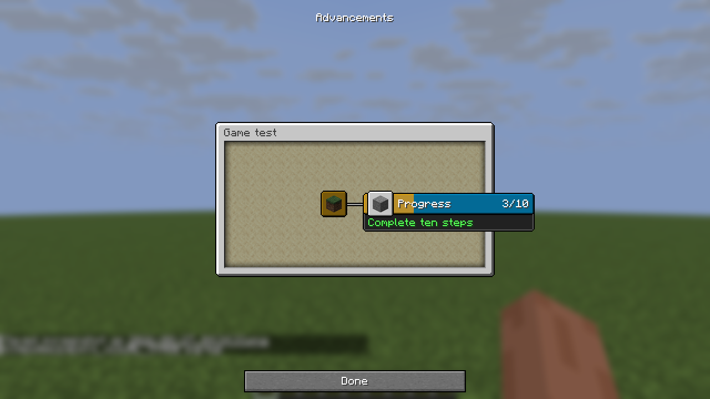

<div align="center">
  
  <h1>ktAdvancements</h1>
</div>

A lightweight, packet-based Minecraft advancements library for Kotlin Spigot/Paper plugins,
with customizable runtimes and data storage.

Define advancement trees, track each player's progress, and control visibility through a typed Kotlin API.
Bundle the library into your plugin and choose the runtime and storage that fit your server.

[Installation](#installation) · [Usage](#usage) · [Runtime options](#runtime-options) · [Data storage](#data-storage) · [Documentation](#documentation)

## Features

- **Typed advancement definitions** — declare parents, icons, titles, frames, and requirements in Kotlin.
- **Per-player progress** — grant, revoke, or set progress, and batch changes in a single update.
- **Visibility control** — show advancements based on progress, completion, or custom conditions.
- **Pluggable runtimes** — choose an aggregate runtime, a version-specific artifact, or your own implementation.
- **Flexible storage** — use [in-memory storage](docs/usage.md#ktadvancementstoreinmemory),
  [SQLite](docs/usage.md#ktadvancementstoresqlite), [MySQL](docs/usage.md#ktadvancementstoremysql), or a [custom store](docs/usage.md#custom-storage).
- **Bundled with your plugin** — include the API and your chosen runtime directly in your plugin JAR.

## Advancement showcase

A custom advancement tree with the `Progress` advancement at **3/10**.



## Installation

Stable releases are available from Maven Central. This library requires both API and runtime
components, which should be bundled into your plugin. Add the following to your `build.gradle.kts`:

```kotlin
repositories {
    mavenCentral()
}

dependencies {
    implementation("dev.s7a:ktAdvancements-api:1.0.0")
    // Spigot (all supported versions), or Paper through 1.20.4.
    implementation("dev.s7a:ktAdvancements-runtime:1.0.0")

    // Add any of the following store implementations as needed
    // implementation("dev.s7a:ktAdvancements-store-XXX:1.0.0")
}
```

- For other runtime options, see the [Runtime Options](#runtime-options) section below.
- For storage options, see the [Data Storage](#data-storage) section below.

For Paper 1.20.5+, replace the runtime dependency with `ktAdvancements-runtime-mojang`
and [mark your final plugin JAR as Mojang-mapped](docs/runtimes.md#mojang-mapped-vs-spigot-mapped).
Use exactly one runtime option. Run the server with Java 17 for 1.17.1–1.20.4,
Java 21 for 1.20.5–1.21.11, or Java 25 for 26.1+.

See the [changelog](CHANGELOG.md) for release notes and [release guide](RELEASING.md)
for the maintainer's publication process.

## Usage

Define your advancement tree using `KtAdvancement`, then create one `KtAdvancements` instance with a store.
The [example plugin](example) contains the complete advancement definitions and event handlers:

```kotlin
val ktAdvancements = KtAdvancements(Advancement.entries, KtAdvancementStore.InMemory())

// Show the tree when a player joins.
ktAdvancements.showAll(player)

// Add one step when the player completes the relevant action.
ktAdvancements.grant(player, Advancement.MineStone, step = 1)
```

See the [usage guide](docs/usage.md) for definitions, visibility, progress updates, and transactions.
In-memory progress is lost when the process stops; choose persistent storage when progress must survive restarts.

## Runtime Options

Choose exactly one aggregate, version-specific, or custom runtime.
The [runtime guide](docs/runtimes.md) lists supported releases, Java requirements, and the mapping rules for Paper and Spigot.

## Data Storage

Use the built-in in-memory store or add a SQLite, MySQL, or custom store.
The [storage guide](docs/usage.md#data-storage) covers dependencies, initialization, and custom implementations.

## Documentation

- [Usage](docs/usage.md): advancement definitions, visibility, progress, and storage.
- [Runtime options and compatibility](docs/runtimes.md): select artifacts for your server.
- [Development](docs/development.md): module structure, game tests, and screenshot baselines.
- [Changelog](CHANGELOG.md): release changes.
- [Release guide](RELEASING.md): maintainer publication steps.

## Agent Skill

The [ktAdvancements skill](skills/ktadvancements/SKILL.md) provides usage guidance for AI agents. Install it with either command:

```sh
gh skill install sya-ri/ktAdvancements skills/ktadvancements
# Alternative:
npx skills add sya-ri/ktAdvancements --skill ktadvancements
```

## License

ktAdvancements is available under the [MIT License](LICENSE).
