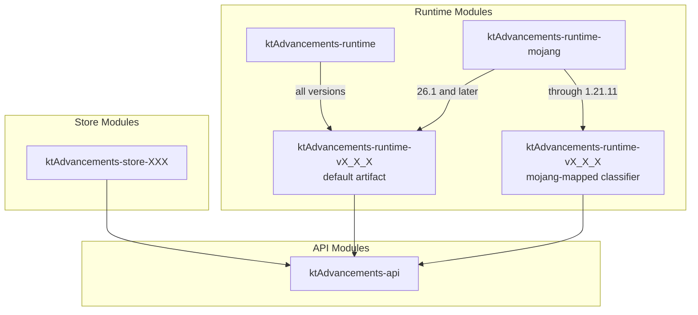

# Development

## Project Structure



The library is divided into several modules with the following dependencies:

1. **API Modules**: Define interfaces and data structures
   - `ktAdvancements-api`: Core advancement data structures and runtime interface definitions

2. **Runtime Modules**: Version-specific implementations
   - `ktAdvancements-runtime`: Aggregates Spigot-mapped runtimes through 1.21.11 and unobfuscated runtimes from 26.1 onward
   - `ktAdvancements-runtime-mojang`: Aggregates Mojang-mapped runtimes through 1.21.11 and the same unobfuscated runtimes from 26.1 onward
   - Each version has its own runtime module (e.g., `ktAdvancements-runtime-vX_X_X`)
   - Through 1.21.11, Mojang-mapped runtime artifacts use the `mojang-mapped` classifier
   - From 26.1 onward, both aggregators use the version module's normal JAR without a classifier

3. **Store Modules**: Data storage implementations
   - `ktAdvancements-store-sqlite`: SQLite-based persistent storage
   - `ktAdvancements-store-mysql`: MySQL-based persistent storage

## Game tests and screenshots

The `game-test` module tests every supported runtime directory, from 1.17.1 through 26.2 (30 versions).
It builds the current project directly; it does not use previously published `mavenLocal` artifacts.
Run Gradle with JDK 25. Server/client launchers use Java 17, 21, or 25 as appropriate.

```sh
# Real-server tests: runtime selection, display definitions, visibility, and packet progress.
./gradlew :game-test:gameTestAll
# One version (use underscores in task names).
./gradlew :game-test:gameTest26_2
```

Screenshot tests also launch an isolated vanilla client, join the local test server, open the
Advancements screen, hover the `Progress` advancement, and save Minecraft's own F2 screenshots.
The four stages are **0/10**, **3/10**, **10/10**, and **9/10** after revoking one step.
Each stage waits for its screenshot acknowledgement before advancing. Packet tests run first.
Image checks verify PNG decoding, 1280×720 resolution, the advancement window/background, both nodes,
and the hovered tooltip. The bar's fill boundary and the exact `Progress` title and progress fraction
are checked against vanilla's bitmap glyphs, rejecting empty screens, missing tooltips, and wrong stages.
The real full-frame screenshots are committed under
[`game-test/src/test/screenshots/<version>/`](../game-test/src/test/screenshots).
Each run compares the advancement window and tooltip against the corresponding baseline PNG,
including its text, icons, background, and progress bar. A changed pixel beyond an RGB-channel
tolerance of 8 fails the test. The changing world/chat and transparent outer corners are excluded;
the comparison regions are fixed from the expected image, never chosen from the new capture.
The content checks above remain in place, so updating a baseline cannot approve an empty or wrong-stage screen.

For automatic capture on Linux x86_64, install `python3`, `xdotool`, `xvfb`, `xauth`, and the usual
Minecraft OpenGL/audio libraries (on Ubuntu: `libgl1-mesa-dri libglx-mesa0 libopenal1 libxrandr2 libxinerama1 libxcursor1 libxi6`):

```sh
xvfb-run -a -s '-screen 0 1280x720x24' ./gradlew :game-test:screenshotTest26_2
xvfb-run -a -s '-screen 0 1280x720x24' ./gradlew :game-test:screenshotTestAll --continue
```

Windows x86_64 uses manual F2 capture with the same server, stage synchronization, and image checks:

```powershell
.\gradlew.bat :game-test:screenshotTest26_2
```

At the first capture prompt, press **L**, hover the stone `Progress` icon, then press **F2**.
Keep the screen open and the cursor on that icon; press F2 again at each subsequent stage prompt.
Do not resize the window or change GUI scale. Linux can also opt into this mode with
`-PgameTestScreenshotDriver=manual`.
For clients without Quick Play (1.17.1 through 1.19.4), the task waits for vanilla's initial
resource reload before connecting. Linux then uses Direct Connection automatically; in manual mode,
join the displayed loopback address when prompted. This avoids entering the world before its models load.

Missing or different baseline images fail the test; CI never updates them. To intentionally accept
a visual change, regenerate the selected version, review and commit its PNG changes, then run again
without the update flag:

```sh
xvfb-run -a -s '-screen 0 1280x720x24' ./gradlew :game-test:screenshotTest26_2 -PupdateGameTestScreenshots=true
git diff --stat -- game-test/src/test/screenshots
xvfb-run -a -s '-screen 0 1280x720x24' ./gradlew :game-test:screenshotTest26_2
```

Use `screenshotTestAll` with the same explicit update flag to regenerate every supported version.
All four real captures must pass the content checks before any baseline is replaced.

Outputs are kept under `game-test/build/`:

- `visual/<version>/exchange/screenshots/{zero,partial,complete,revoked}.png`
- `visual/<version>/comparison/report.properties` and expected/actual/diff PNGs for image differences
- `visual/<version>/result.properties`, server/client logs, and screenshot-driver logs
- `servers/run-<version>/result.properties` and `server.log` for packet tests

The GitHub Actions workflow runs the entire version matrix and uploads each version's actual screenshots,
baseline-comparison reports, difference images, and diagnostic results. Failed jobs also preserve raw F2 captures, client crash reports, and BuildTools logs
in a separate `failure-diagnostics` artifact; those raw images have not passed the image checks.
The same compiled test classes are packaged twice, with all supported runtimes
and multi-release implementation classes retained in both JARs:

- `:game-test:shadowJar` creates `game-test-all.jar`, using the same runtime artifacts as `ktAdvancements-runtime`.
  Old Paper (through 1.20.4) and Spigot tests use this variant.
- `:game-test:mojangShadowJar` creates `game-test-mojang-all.jar`, using the same normal runtime JARs as
  `ktAdvancements-runtime-mojang` and declaring `paperweight-mappings-namespace: mojang`.
  Paper 1.20.5+ tests use this variant without startup remapping.

CI builds both once and reuses those exact JARs via
`-PgameTestPluginJar=/absolute/path/game-test-all.jar` and
`-PgameTestMojangPluginJar=/absolute/path/game-test-mojang-all.jar`.
The tasks select the appropriate variant automatically. Ordinary `build`/`check` do not launch Minecraft.
The image validator and Linux capture driver also have GUI-free unit tests:

```sh
./gradlew -p buildSrc test
python3 -B -m unittest discover -s game-test/scripts -p 'test_*.py'
```

Paper distributions are used where available. Exact releases 1.20.3 and 26.1 have no Paper
distribution, so the tasks build Spigot with BuildTools revisions **3961** and **4608**, respectively.
To supply an already-built exact-version server, use `-PgameTestSpigot1_20_3Jar=/path/to/spigot-1.20.3.jar`
or `-PgameTestSpigot26_1Jar=/path/to/spigot-26.1.jar`. The reported runtime and Bukkit version are checked.

These opt-in tasks download Minecraft software and write `eula=true` for their disposable test
servers. Run them only if you own Minecraft and accept the [Minecraft EULA](https://www.minecraft.net/eula).
[PortableMC 5.0.4](https://github.com/theorzr/portablemc/releases/tag/v5.0.4) is SHA-256-pinned.
Clients use dedicated game/cache directories and an offline test name, without reading launcher
accounts or modifying existing Minecraft settings. Servers bind only to `127.0.0.1`.
Do not commit or upload downloaded server/client JARs, assets, worlds, or account files; CI only
shares this project's two compiled test-plugin variants, screenshots, and diagnostic logs.
